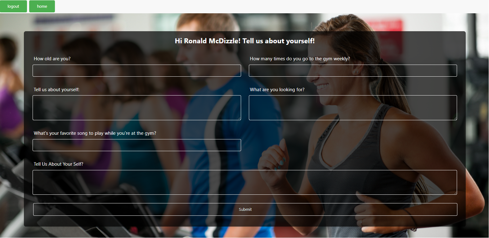
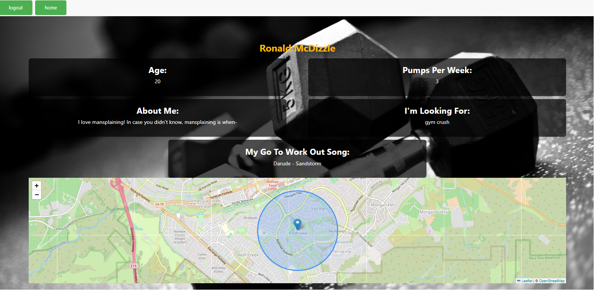

# Pumpr: A Dating App for Fitness Enthusiasts

## Description

Dating can tough, and it can often be just as difficult to meet people who share a passion for fitness. With this app, Pumpr, our goal is to combine fitness and flirting. Pumpr connects users with their gym crushes or helps them find platonic gym partners to share a work out with.

In its current state, Pumpr allows users to create a profile and search for other users by email. It also features a map displaying the user's location, though this will eventually be used to filter search results by area. We are excited to further develop Pumpr and bring gains to hearts and muscles across the world

### Future Development 

* Allow users to browse other user profiles
* Allow users to filter user results with user interests
* Add music player to each profile
* Integrate map into search
* Allow users to upload photos and videos
* Add a messaging feature
* Allow users to customize certain profile questions 

## Tasks

### User Story
AS AN employee with a busy schedule
I WANT to add important events to a daily planner
SO THAT I can manage my time effectively

AS A fitness enthusiast looking for more than just gains 
I WANT to connect with like-minded singles who share my passion for fitness 
SO THAT I can find a workout partner who not only motivates me to break a sweat but also makes my heart race with excitement

## Usage

To run this locally, user must perform the following:
* Open in Integrated terminal
* npm i nodemon
* mysql -u root -p
* SOURCE db/schema.sql
* quit
* npm run seed
* npm start

Once the app is open, users can:
* Sign up on log in page

* Access home page

* Create a profile by filling out a questionnaire

*  Search for other users by email address

* View their profile

* Log out

## Links

Link to deployed website: https://pumpr-de6975ce74ef.herokuapp.com/profile
Link to repository: https://github.com/Evanilla57/pumpr

## Collaborators
* Evan Griggs - https://github.com/Evanilla57
* Stephany P - https://github.com/splacito22
* Makayla Russell - https://github.com/makandcheese04
* Laura Tavira - https://github.com/taviral55
* Edward Salgado - https://github.com/esalgado12329

## Credits
* https://developer.mozilla.org/en-US/docs/Learn/JavaScript/Client-side_web_APIs/introduction
* https://www.bezkoder.com/node-js-express-sequelize-mysql/
* https://kinsta.com/blog/javascript-libraries/
* https://www.openstreetmap.org/copyright
* http://www.heroku.com/
* The Coding Boot Camp at UCR Extension:
UCR-VIRT-FSF-PT-06-2023-U-LOLC\14-MVC\01-Activities\13-Ins_Custom-Helpers
* The Coding Boot Camp at UCR Extension: 
UCR-VIRT-FSF-PT-06-2023-U-LOLC\14-MVC\01-Activities\28-Stu_Mini-Project
* Incredible Support from UCR Staff: Josh Taylor, Vito Vittore, Ivo Gatzinski

## License
MIT License​Copyright (c) [2023] ​Permission is hereby granted, free of charge, to any person obtaining a copy of this software and associated documentation files (the "Software"), to deal in the Software without restriction, including without limitation the rights to use, copy, modify, merge, publish, distribute, sublicense, and/or sell copies of the Software, and to permit persons to whom the Software is furnished to do so, subject to the following conditions:​The above copyright notice and this permission notice shall be included in all copies or substantial portions of the Software.​THE SOFTWARE IS PROVIDED "AS IS", WITHOUT WARRANTY OF ANY KIND, EXPRESS OR IMPLIED, INCLUDING BUT NOT LIMITED TO THE WARRANTIES OF MERCHANTABILITY, FITNESS FOR A PARTICULAR PURPOSE AND NONINFRINGEMENT. IN NO EVENT SHALL THE AUTHORS OR COPYRIGHT HOLDERS BE LIABLE FOR ANY CLAIM, DAMAGES OR OTHER LIABILITY, WHETHER IN AN ACTION OF CONTRACT, TORT OR OTHERWISE, ARISING FROM, OUT OF OR IN CONNECTION WITH THE SOFTWARE OR THE USE OR OTHER DEALINGS IN THE SOFTWARE.